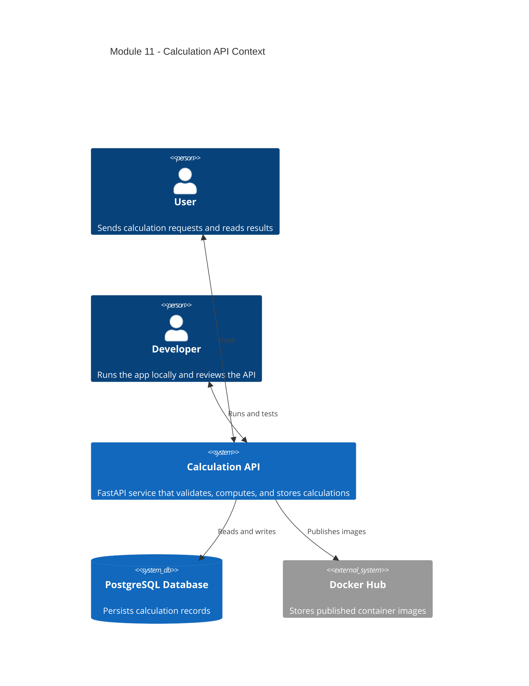
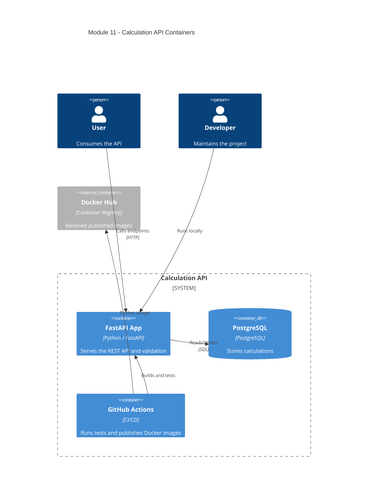
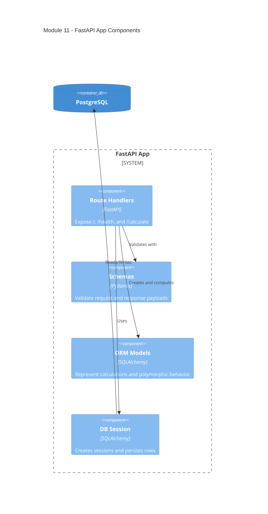
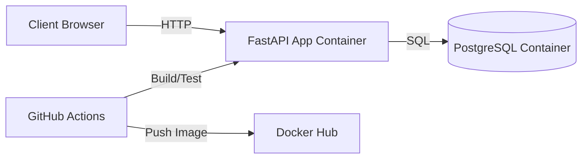

# C4 Architecture Diagrams

## System Context

```mermaid
C4Context
    title Module 11 - Calculation API Context

    Person(user, "User", "Sends calculation requests and reads results")
    Person(developer, "Developer", "Runs the app locally and reviews the API")

    System(api, "Calculation API", "FastAPI service that validates, computes, and stores calculations")
    SystemDb(database, "PostgreSQL Database", "Persists calculation records")
    System_Ext(dockerHub, "Docker Hub", "Stores published container images")

    BiRel(user, api, "Uses")
    BiRel(developer, api, "Runs and tests")
    Rel(api, database, "Reads and writes")
    Rel(api, dockerHub, "Publishes images")
```

## Container Diagram

```mermaid
C4Container
    title Module 11 - Calculation API Containers

    Person(user, "User", "Consumes the API")
    Person(developer, "Developer", "Maintains the project")

    System_Boundary(system, "Calculation API") {
        Container(web, "FastAPI App", "Python / FastAPI", "Serves the REST API and validation")
        ContainerDb(db, "PostgreSQL", "PostgreSQL", "Stores calculations")
        Container(ci, "GitHub Actions", "CI/CD", "Runs tests and publishes Docker images")
    }

    Container_Ext(registry, "Docker Hub", "Container Registry", "Receives published images")

    Rel(user, web, "Calls endpoints", "HTTP")
    Rel(developer, web, "Runs locally")
    Rel(web, db, "Reads/Writes", "SQL")
    Rel(ci, web, "Builds and tests")
    Rel(ci, registry, "Pushes image")
```

## Component Diagram

```mermaid
C4Component
    title Module 11 - FastAPI App Components

    ContainerDb(db, "PostgreSQL")

    System_Boundary(api, "FastAPI App") {
        Component(routes, "Route Handlers", "FastAPI", "Expose /, /health, and /calculate")
        Component(schemas, "Schemas", "Pydantic", "Validate request and response payloads")
        Component(models, "ORM Models", "SQLAlchemy", "Represent calculations and polymorphic behavior")
        Component(database, "DB Session", "SQLAlchemy", "Creates sessions and persists rows")
    }

    Rel(routes, schemas, "Validates with")
    Rel(routes, models, "Creates and computes")
    Rel(routes, database, "Uses")
    Rel(database, db, "Reads/Writes")
```

## Deployment Diagram

```mermaid
flowchart LR
    browser[Client Browser] -->|HTTP| app[FastAPI App Container]
    app -->|SQL| db[(PostgreSQL Container)]
    github[GitHub Actions] -->|Build/Test| app
    github -->|Push Image| dockerhub[Docker Hub]
```
